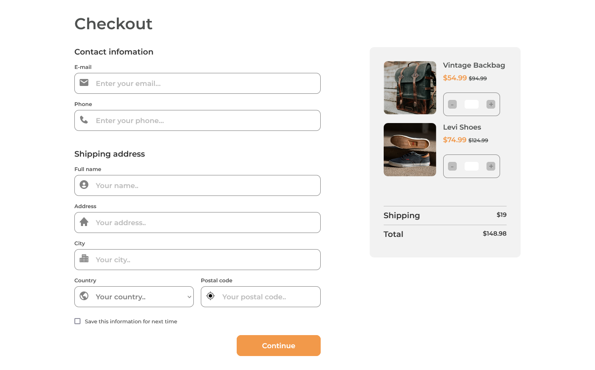
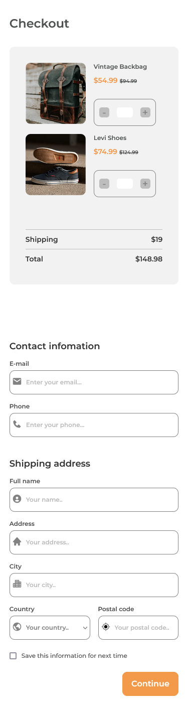

<h1 align="center">Checkout page master</h1>

   Solution for a challenge from  <a href="http://devchallenges.io" target="_blank">Devchallenges.io</a>.

  <h3>
    <a href="https://github.com/AngelDev2001/Checkout-page-master---AngelDev2001/">
      Solution
    </a>
     | 
    <a href="https://devchallenges.io/challenges/0J1NxxGhOUYVqihwegfO">
      Challenge
    </a>
  </h3>

<!-- TABLE OF CONTENTS -->

## Table of Contents

- [Overview](#overview)
  - [Built With](#built-with)
- [Features](#features)
- [Contact](#contact)

## Overview

- Where can I see your demo?
[DEMO](https://angeldev2001.github.io/Checkout-page-master---AngelDev2001/)

### Built With

- HTML
- CSS

## Features

This application/site was created as a submission to a [DevChallenges](https://devchallenges.io/challenges) challenge. The [challenge](https://devchallenges.io/challenges/0J1NxxGhOUYVqihwegfO) was to build an application to complete the given user stories.

## Contact

- GitHub [@AngelDev2001](https://github.com/AngelDev2001)
